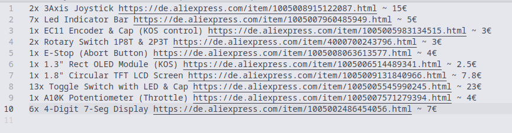
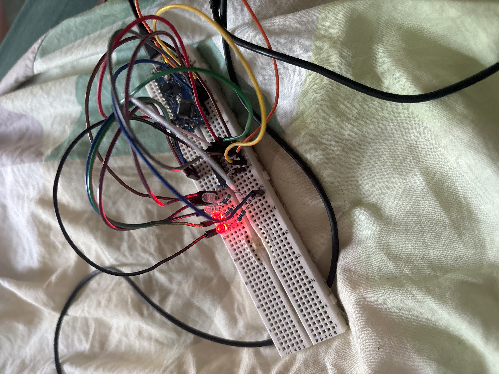
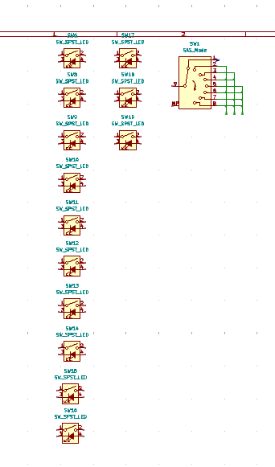
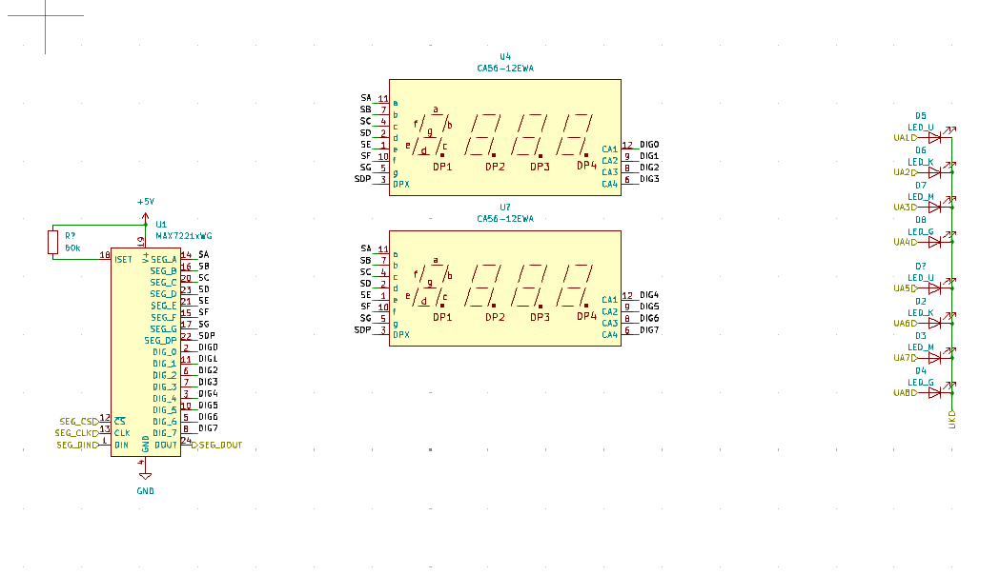
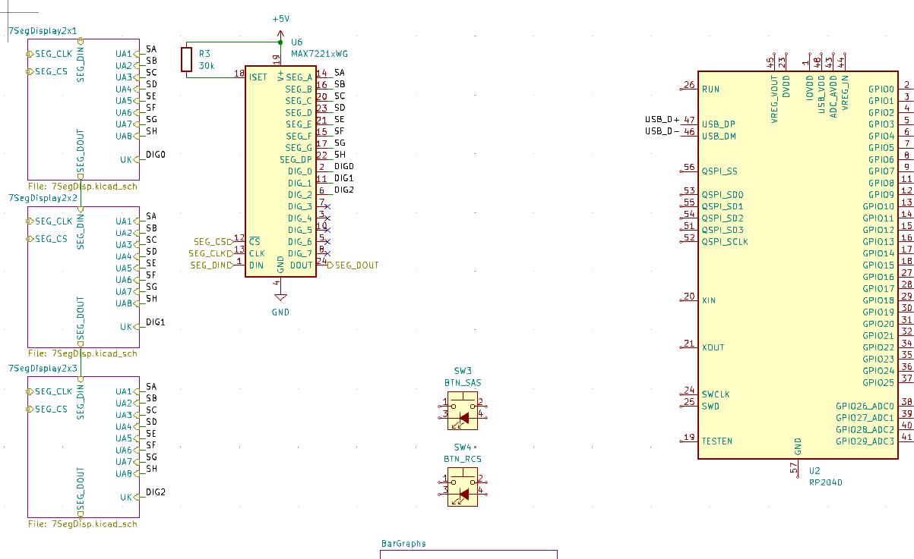

# Journal of project kadmium-simpit

### *2025-06-14*

---
### Design sesh

did a rough design of all needed components/inputs
also got a copy of KSP1 again which was way more annoying than i thought cause of the KSP2 thingy
also installed KerbalSimpit mod & Arduino library for testing

#### 1h

---

 

---
### Starting the PCB + picking out components on Ali

i think i might just use two atmegas (one for the main program and one for navball graphics)

#### 1.5h

---

 

### *2025-06-15*

---
### a bit of pcb design

Did some research for the main ic (gonna use one rp2040 for everything) 

#### 2.5h

---

 

### *2025-06-17*

---
### Circuit Design again

Did aome testing with a shift register, and made a lot of the led circuits. MAX2771 my beloved

#### 5h

---

 

